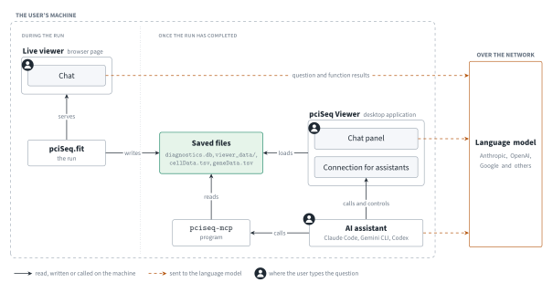
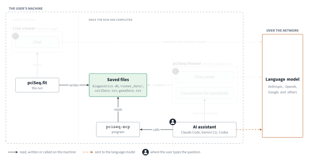
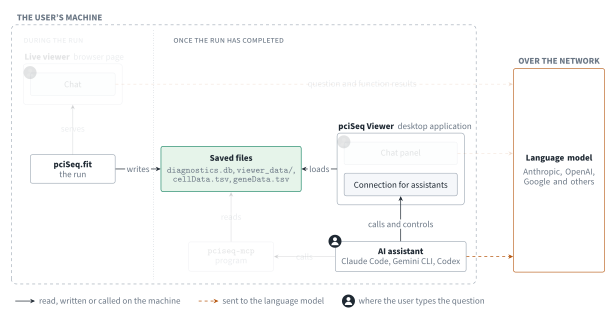
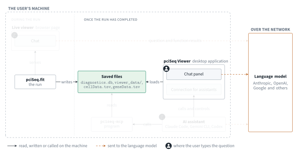
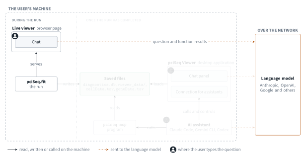

<div align="center">

# pciSeq

**Probabilistic cell typing for imaging-based spatial transcriptomics, in 3D**

[](https://acycliq.github.io/pciSeq_3d/)
[](https://github.com/acycliq/pciSeq_3d/actions/workflows/pytest.yaml)
[](#installation)
[](LICENSE)

[Documentation](https://acycliq.github.io/pciSeq_3d/) ·
[Quick start](#quick-start) ·
[Method](#method) ·
[Diagnostics](#diagnostics)

</div>

pciSeq assigns each RNA spot of an imaging-based spatial transcriptomics experiment to a
cell, and each cell to a cell type. The two assignments are estimated jointly: the class
of a cell depends on the spots inside it, and the cell of a spot depends on the classes
of the cells around it. Both come back as probabilities. pciSeq_3d works on a stack of
segmented planes.

<p align="center">

</p>

<p align="center"><sub><em>The live viewer during a fit, one frame per iteration. Cells are
coloured by the class they are currently assigned to, and the chart at the bottom right
tracks convergence.</em></sub></p>

## Overview

- **Joint assignment.** A spot is assigned to a cell given the cell's class, and a cell is
  given a class from the spots assigned to it. The two are updated in turn until they
  agree.
- **Probabilistic output.** A spot on the boundary of two cells gets probability on both.
  A spot no cell explains goes to the background. A cell's count of a gene is an expected
  count, such as 4.3.
- **3D.** Spots carry a plane, the segmentation is a stack, and the neighbours of a cell
  are taken in 3D with the voxel size accounted for.
- **Diagnostics.** Ask an AI agent why a cell got its class or why a spot went to a cell,
  or call `check_cell` and `check_spot`. Both read the terms of the score.
- **Two viewers.** The live viewer, a browser page, shows the classes settling, iteration
  by iteration. pciSeq Viewer, a desktop application, opens the saved files, in 2D and
  in 3D.
- **Output formats.** pandas DataFrames in memory; tsv, feather and a
  [SpatialData](https://spatialdata.scverse.org) zarr store on disk.

A 3D coppaFISH dataset of mouse hippocampus, 3,018,812 spots, 25,254 cells, 90 planes,
205 genes and 38 cell types, converged in 75 iterations and 12 minutes on a 4-core
laptop CPU (Intel i7-1165G7), without a GPU.

## Installation

```bash
pip install git+https://github.com/acycliq/pciSeq_3d.git@dev_3d
```

Python 3.10 or newer.

The `mcp` extra adds `pciseq-mcp`, the program through which an AI assistant such as
Claude Code, Gemini CLI or Codex reads the files a completed run saved. It is optional;
the chats inside the live viewer and pciSeq Viewer work without it. How the assistant is
told about the program is in [Agent tools](#agent-tools).

```bash
pip install "pciSeq_3d[mcp] @ git+https://github.com/acycliq/pciSeq_3d.git@dev_3d"
```

## Quick start

```python
import numpy as np
import pandas as pd
from scipy.sparse import coo_matrix
import pciSeq

spots = pd.read_csv("spots.csv")                             # gene_name, x, y, z_plane
coo = [coo_matrix(plane) for plane in np.load("masks.npy")]  # one label matrix per plane
scRNAseq = pd.read_csv("scRNAseq.csv", index_col=0)          # genes x cell types

opts = {
    "voxel_size": [0.28, 0.28, 0.7],
    "output_path": "out/run1",
    "realtime_viewer": True,     # watch it run at http://127.0.0.1:5001
}

cellData, geneData = pciSeq.fit(spots=spots, coo=coo, scRNAseq=scRNAseq, opts=opts)
```

Or from the command line, with the inputs and settings in one file
([command line](https://acycliq.github.io/pciSeq_3d/api/command-line)):

```bash
pciseq run analysis.yaml --set rTheta=5 --set mrf_beta=0
```

### Inputs

| Input | Description |
| --- | --- |
| **Spots** | A table of detected RNA spots with gene identity and position: `gene_name`, `x`, `y`, and `z_plane` for 3D data. |
| **Segmentation** | A label image giving the cell each pixel belongs to, typically from a DAPI nuclear stain. One label matrix per plane. |
| **Cell type definitions** | Mean expression per gene for each cell type, for example from a scRNA-seq experiment. |

### Outputs

| Output | Description |
| --- | --- |
| **`cellData`** | For every cell, a probability distribution over the cell types, and its expected gene counts. |
| **`geneData`** | For every spot, a probability distribution over its candidate parent cells and the background. |

Both come back as pandas DataFrames. With `save_data` on, the default, a run also writes
these under `<output_path>/pciSeq/data/`:

| File | For |
| --- | --- |
| `cellData.tsv`, `geneData.tsv`, `cellBoundaries.tsv` | any downstream tool |
| `spatialdata.zarr` | the scverse ecosystem ([SpatialData store](https://acycliq.github.io/pciSeq_3d/api/spatialdata-store)) |
| `viewer_data/` | pciSeq Viewer |
| `viewer_data/diagnostics/diagnostics.db` | the terms behind every call, the settings, and the documentation of the version that made the run |
| `debug/pciSeq.pickle` | the fitted model, for `check_cell` and `check_spot` |

See [working with results](https://acycliq.github.io/pciSeq_3d/api/working-with-results).

## Method

Every unknown is a latent variable of one Bayesian model: the cell of origin of each
spot, the class of each cell, the detection efficiency of each gene, a scale factor per
cell, and one per gene in each cell. The joint posterior is approximated by variational
inference and fitted by coordinate ascent, four updates repeated until the estimates
stop changing.

1. **[Misread density.](https://acycliq.github.io/pciSeq_3d/how-it-works/misread-density)**
   The rate of background spots per gene, estimated from the spots currently assigned to
   the background.
2. **[Warping the cell type definitions.](https://acycliq.github.io/pciSeq_3d/how-it-works/warping-the-reference)**
   The reference and the experiment are on different scales. Four factors rescale the
   reference: one for the whole experiment, one per gene, one per cell, one per gene in
   each cell.
3. **[Cell to class.](https://acycliq.github.io/pciSeq_3d/how-it-works/cell-to-celltype)**
   Every cell is scored against every class with the rescaled definitions, a class prior
   and a spatial term from its neighbours. The scores are normalised to probabilities.
4. **[Spots to cells.](https://acycliq.github.io/pciSeq_3d/how-it-works/spots-to-cells)**
   Every spot is assigned to one of its neighbouring cells or to the background, as a
   probability, given the cell class probabilities.

The mathematics is in [the model](https://acycliq.github.io/pciSeq_3d/the-model/overview).

## Diagnostics

pciSeq saves with its results, for every cell and every spot, the terms from which its
assignment was computed. For a cell these are the log-likelihood of its gene counts
under each class, the log prior of each class, and the contribution of the neighbouring
cells. For a spot they are the distance to each candidate cell, the expression terms,
and the background rate. The assignment probability follows from the sum of these terms,
so any assignment can be decomposed into the quantities that produced it. The terms are
accessible in two ways: through the agent, and through the methods `check_cell` and
`check_spot`.

### Agent tools

The agent is a language model equipped with functions that read the files a completed
run saved. Its purpose is to explain the assignments of the statistical model: why a
cell was assigned to its class, why a spot was assigned to one cell rather than
another, what value a setting took in a given run, and what a term such as the gene
inefficiency denotes. Each answer is derived from those files, not from the general
knowledge of the language model. The agent performs no computation; every number it
reports is returned by one of the functions. The method is described from the
documentation saved with the run, so that an older run is explained by the version of
pciSeq that produced it.

Within pciSeq Viewer, the desktop application, the agent can additionally control the
display: move the view to a cell, open the diagnostics panel for a cell or a spot, and
show or hide classes and genes.

The diagram shows the four ways of asking and what each one uses. Select a way to see its
parts; the person marks where the question is typed.

<details name="agent_access" open>
<summary>All</summary>
<p align="center">
<picture>
<source media="(prefers-color-scheme: dark)" srcset="website/docs/public/agent_access-all-dark.svg">

</picture>
</p>
</details>

<details name="agent_access">
<summary>An AI assistant with <code>pciseq-mcp</code></summary>
<p align="center">
<picture>
<source media="(prefers-color-scheme: dark)" srcset="website/docs/public/agent_access-mcp-dark.svg">

</picture>
</p>
</details>

<details name="agent_access">
<summary>An AI assistant connected to pciSeq Viewer</summary>
<p align="center">
<picture>
<source media="(prefers-color-scheme: dark)" srcset="website/docs/public/agent_access-viewer-dark.svg">

</picture>
</p>
</details>

<details name="agent_access">
<summary>The chat panel in pciSeq Viewer</summary>
<p align="center">
<picture>
<source media="(prefers-color-scheme: dark)" srcset="website/docs/public/agent_access-panel-dark.svg">

</picture>
</p>
</details>

<details name="agent_access">
<summary>The live viewer's chat</summary>
<p align="center">
<picture>
<source media="(prefers-color-scheme: dark)" srcset="website/docs/public/agent_access-live-dark.svg">

</picture>
</p>
</details>

<p align="center"><sub><em>The same diagram, with the ways switched in place, is in the
<a href="https://acycliq.github.io/pciSeq_3d/accessing-the-ai-agent">documentation</a>.</em></sub></p>

The diagram has four places where a question is typed, one person icon each. The four
are described below by the arrows that leave them and by what has to be set up to draw
those arrows.

#### The live viewer's chat

The live viewer is the browser page `pciSeq.fit` serves while it runs, with
`realtime_viewer` on. Its chat answers about the fit in progress. It sends the question
and the function results to the language model, so it requires an API key, entered in
the page. Nothing is installed or registered. The chat ends when the run does.

#### An AI assistant with `pciseq-mcp`

Once the run has completed, an AI assistant reaches the saved files through
`pciseq-mcp`, the program installed with the `mcp` extra (see
[Installation](#installation)). The arrow "calls" is drawn once, by telling the
assistant about the program, with the line for the one in use:

```bash
claude mcp add --scope user pciseq -- pciseq-mcp             # Claude Code
gemini mcp add --scope user pciseq pciseq-mcp                 # Gemini CLI
codex mcp add pciseq -- pciseq-mcp                            # OpenAI Codex CLI and ChatGPT desktop app
code --add-mcp '{"name":"pciseq","command":"pciseq-mcp"}'     # VS Code
```

Claude Desktop and Cursor have no such command; for these the program is added to a
settings file by hand, as described in
[MCP server](https://acycliq.github.io/pciSeq_3d/api/mcp-server). ChatGPT and claude.ai
in the browser cannot be used, since a web page cannot reach a program on the user's
machine.

The assistant must be started from a terminal in which the `pciseq-mcp` command is
found. With conda or a virtual environment, that is the environment pciSeq is
installed in. The question names the folder `pciSeq.fit` saved its results in, the
`output_path` of the run:

```
Open the run in out/run1 and explain why cell 100 was assigned to its class.
```

No viewer is involved, so this is the way for a machine without a screen.

#### An AI assistant connected to pciSeq Viewer

pciSeq Viewer is the desktop application that opens the saved files. While it has them
loaded it accepts connections from an AI assistant at a local address. The arrow "calls
and controls" is drawn once, by registering that address with the assistant (the form
for Claude Code):

```bash
claude mcp add --transport http pciseq-viewer http://127.0.0.1:8317/mcp
```

Then load the saved files in pciSeq Viewer, by selecting the `viewer_data` folder of
the run, start the assistant and ask. The assistant reads the files as loaded in pciSeq
Viewer and controls the display. The question names no folder; the data on screen are
the ones queried. This way does not use `pciseq-mcp`, and the `mcp` extra is not
needed.

#### The chat panel in pciSeq Viewer

The chat panel reads the same loaded files and controls the display in the same way,
with no assistant. It requires an API key, entered in pciSeq Viewer.

#### Summary

| | When | Reads | Controls pciSeq Viewer? | Requires |
| --- | --- | --- | --- | --- |
| The live viewer's chat | during the run | the fit in progress | no | an API key |
| An AI assistant with `pciseq-mcp` | once the run has completed | the saved files, from the output folder of the run | no | the `mcp` extra and one `mcp add` |
| An AI assistant connected to pciSeq Viewer | once the run has completed | the saved files, as loaded in pciSeq Viewer | yes | pciSeq Viewer running and one `mcp add` |
| The chat panel in pciSeq Viewer | once the run has completed | the saved files, as loaded in pciSeq Viewer | yes | an API key |

The three that read the saved files report the same numbers for the same cell or spot;
they differ in what has to be set up and in whether the answer can be shown on screen.

<table align="center" width="100%">
<tr><th>The chat panel in pciSeq Viewer</th></tr>
<tr><td>

</td></tr>
</table>

<p align="center"><sub><em>Cell 5016: the panel is asked to move to the cell and explain
its class, then to open the diagnostics and describe them. The language model is Claude
Sonnet 5; pauses while it responds are cut to half.</em></sub></p>

The language model is chosen by the user. As of 6 October 2026, the live viewer's chat
takes an API key from Anthropic; the chat panel in pciSeq Viewer takes that, or any
endpoint that speaks the Anthropic Messages protocol, given its base URL. With an AI
assistant the language model is the assistant's own. In every case the saved files stay
on the user's machine; only the results the agent asks for are sent to the language
model.

### Diagnostic figures

[`check_cell`](https://acycliq.github.io/pciSeq_3d/api/reference#check-cell) and
[`check_spot`](https://acycliq.github.io/pciSeq_3d/api/reference#check-spot) are methods
of the fitted model. They draw the same terms the agent reads: for a cell, the genes
contributing most to each of two classes and the three terms of its score; for a spot,
one bar per candidate cell and the background, split into the terms of the score. The
second argument of `check_cell` is the class to compare the call against.

```python
obj = pd.read_pickle("out/run1/pciSeq/data/debug/pciSeq.pickle")
obj.check_cell(cell_label, class_name)
obj.check_spot(spot_id)
```

Both are walked through in the documentation:
[how a cell's call was made](https://acycliq.github.io/pciSeq_3d/explaining-the-calls/why-a-cell-got-its-type)
and
[how a spot's call was made](https://acycliq.github.io/pciSeq_3d/explaining-the-calls/why-a-spot-got-its-cell).

## Documentation

| Section | Description |
| --- | --- |
| [Running pciSeq](https://acycliq.github.io/pciSeq_3d/running-pciseq) | from Python, from the command line, the settings and how to tune them |
| [How it works](https://acycliq.github.io/pciSeq_3d/how-it-works/overview) | the four steps of the loop, in words and figures |
| [Explaining the calls](https://acycliq.github.io/pciSeq_3d/explaining-the-calls/overview) | `check_cell` and `check_spot`, followed through on one cell and one spot |
| [The model](https://acycliq.github.io/pciSeq_3d/the-model/overview) | the mathematics |
| [API](https://acycliq.github.io/pciSeq_3d/api/reference) | the reference, and a [code map](https://acycliq.github.io/pciSeq_3d/api/code-map) from each model quantity to the line that computes it |

## Licence

MIT, see [LICENSE](LICENSE).
