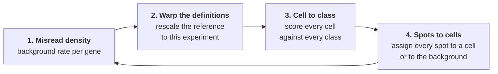
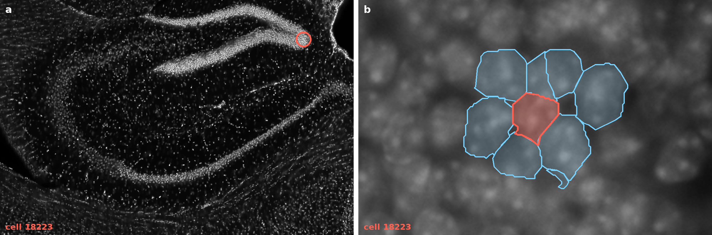
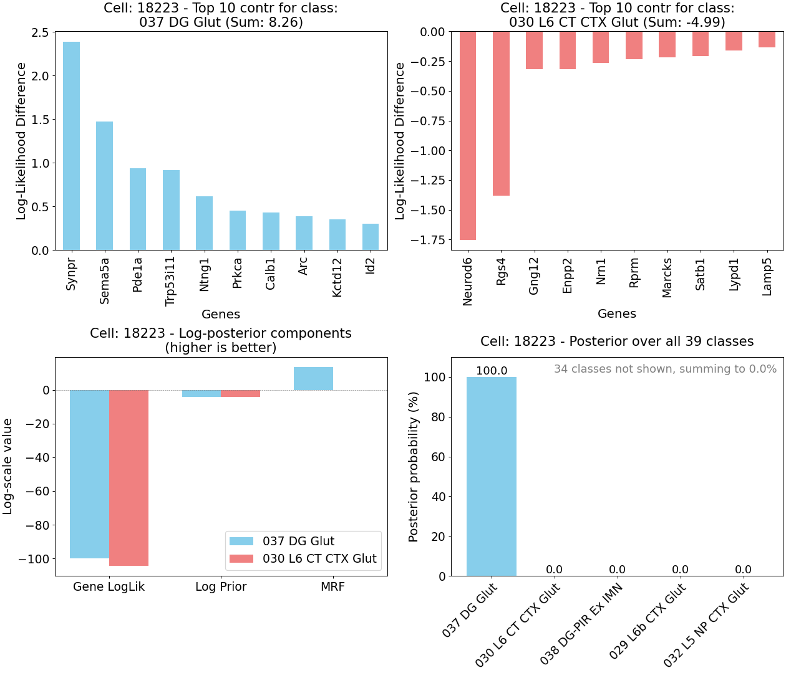
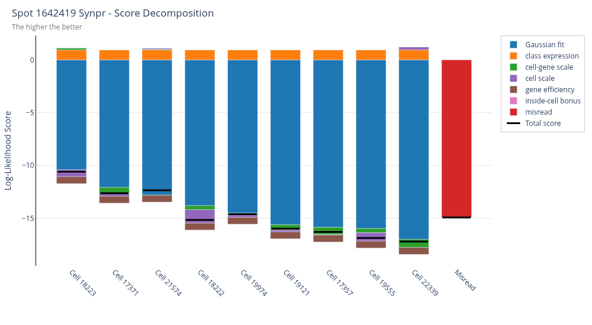

<div align="center">

# pciSeq

**Probabilistic cell typing for imaging-based spatial transcriptomics, in 3D**

[](https://acycliq.github.io/pciSeq_3d/)
[](https://github.com/acycliq/pciSeq_3d/actions/workflows/pytest.yaml)
[](#install)
[](LICENSE)

[Documentation](https://acycliq.github.io/pciSeq_3d/) ·
[Quick start](#quick-start) ·
[How it works](#how-it-works) ·
[Explaining a call](#explaining-a-call) ·
[Ask the run](#ask-in-plain-words) ·
[Viewers](#viewers)

</div>

pciSeq assigns each RNA spot of an imaging-based spatial transcriptomics experiment to a
cell, and each cell to a cell type. The two assignments are estimated jointly: the type of
a cell depends on the spots inside it, and the cell of a spot depends on the types of the
cells around it. Both come back as probabilities. This branch works in 3D, on a stack of
segmented planes.

https://github.com/user-attachments/assets/ab9867e4-866e-4f81-88e5-359bdf7d7a64

<p align="center"><em>The live viewer during a fit, one picture per iteration. Cells are
coloured by the class they are currently assigned to, and the chart at the bottom right
tracks convergence.</em></p>

## At a glance

<table>
<tr>
<td width="33%" valign="top">

**Spots and cells, fitted together**

A spot is assigned to a cell given the cell's class, and a cell is given a class from
the spots assigned to it. The two are updated in turn until they agree.

</td>
<td width="33%" valign="top">

**Probabilities, not labels**

A spot on the boundary of two cells gets probability on both. A spot no cell explains
goes to the background. A cell's count of a gene is an expected count, such as 4.3.

</td>
<td width="33%" valign="top">

**3D**

Spots carry a plane, the segmentation is a stack, and the neighbours of a cell are
taken in 3D with the voxel size accounted for.

</td>
</tr>
<tr>
<td valign="top">

**Every call can be explained**

Ask an AI agent why a cell got its class or why a spot went to a cell, or call
`check_cell` and `check_spot`. Both read the terms the model added up.

</td>
<td valign="top">

**Watch it run**

The live viewer shows the classes settling in a browser, iteration by iteration. The
desktop viewer opens the saved result, in 2D and in 3D.

</td>
<td valign="top">

**Results in standard formats**

pandas DataFrames in memory; tsv, feather and a
[SpatialData](https://spatialdata.scverse.org) zarr store on disk.

</td>
</tr>
</table>

**Size and speed, measured.** A 3D coppaFISH dataset of mouse hippocampus with 3,018,812
spots, 25,254 cells, 90 planes, 205 genes and 38 cell types converged in 75 iterations,
12 minutes, on a 4-core laptop CPU (Intel i7-1165G7) with no GPU.

## Install

```bash
pip install git+https://github.com/acycliq/pciSeq_3d.git@dev_3d
```

Python 3.10 or newer.

## Quick start

```python
import numpy as np
import pandas as pd
from scipy.sparse import coo_matrix
import pciSeq

spots = pd.read_csv("spots.csv")                             # gene_name, x, y, z_plane
coo = [coo_matrix(plane) for plane in np.load("masks.npy")]  # one label matrix per plane
scRNAseq = pd.read_csv("scRNAseq.csv", index_col=0)          # genes x cell types

opts = {
    "voxel_size": [0.28, 0.28, 0.7],
    "output_path": "out/run1",
    "realtime_viewer": True,     # watch it run at http://127.0.0.1:5001
}

cellData, geneData = pciSeq.fit(spots=spots, coo=coo, scRNAseq=scRNAseq, opts=opts)
```

Or from the command line, with the inputs and settings in one file
([command line](https://acycliq.github.io/pciSeq_3d/api/command-line)):

```bash
pciseq run analysis.yaml --set rTheta=5 --set mrf_beta=0
```

### Inputs

| Input | What it is |
| --- | --- |
| **Spots** | A table of detected RNA spots with gene identity and position: `gene_name`, `x`, `y`, and `z_plane` for 3D data. |
| **Segmentation** | A label image giving the cell each pixel belongs to, typically from a DAPI nuclear stain. One label matrix per plane. |
| **Cell type definitions** | Mean expression per gene for each cell type, for example from a scRNA-seq experiment. |

### Outputs

| Output | What it is |
| --- | --- |
| **`cellData`** | For every cell, a probability distribution over the cell types, and its expected gene counts. |
| **`geneData`** | For every spot, a probability distribution over its candidate parent cells and the background. |

Both come back as pandas DataFrames. With `save_data` on, the default, a run also writes:

| File | For |
| --- | --- |
| `cellData.tsv`, `geneData.tsv`, `cellBoundaries.tsv` | any downstream tool |
| `spatialdata.zarr` | the scverse ecosystem ([SpatialData store](https://acycliq.github.io/pciSeq_3d/api/spatialdata-store)) |
| `viewer_data/` | the desktop viewer |
| `viewer_data/diagnostics/diagnostics.db` | the terms behind every call, the settings, and the documentation of the version that made the run |
| `debug/pciSeq.pickle` | the fitted model, for `check_cell` and `check_spot` |

See [working with results](https://acycliq.github.io/pciSeq_3d/api/working-with-results).

## How it works

Every unknown is a latent variable of one Bayesian model: the cell of origin of each
spot, the class of each cell, the detection efficiency of each gene, and the per-cell and
per-gene scale factors. The joint posterior is approximated by variational inference and
fitted by coordinate ascent, four updates repeated until the estimates stop changing.



1. **[Misread density.](https://acycliq.github.io/pciSeq_3d/how-it-works/misread-density)**
   The rate of background spots per gene, estimated from the spots currently assigned to
   the background.
2. **[Warping the cell type definitions.](https://acycliq.github.io/pciSeq_3d/how-it-works/warping-the-reference)**
   The reference and the experiment are on different scales. Four factors rescale the
   reference: one for the whole experiment, one per gene, one per cell, one per gene in
   each cell.
3. **[Cell to class.](https://acycliq.github.io/pciSeq_3d/how-it-works/cell-to-celltype)**
   Every cell is scored against every class with the rescaled definitions, a class prior
   and a spatial term from its neighbours. The scores are normalised to probabilities.
4. **[Spots to cells.](https://acycliq.github.io/pciSeq_3d/how-it-works/spots-to-cells)**
   Every spot is assigned to one of its neighbouring cells or to the background, as a
   probability, given the cell class probabilities.

The mathematics is in [the model](https://acycliq.github.io/pciSeq_3d/the-model/overview).

## Explaining a call

A probability is only useful if you can see where it came from. pciSeq does not ask you
to trust a call: every run saves the terms the model added up to reach it, for every cell
and every spot, and there are two ways to read them. You can ask, or you can call the
functions yourself.

The example is cell 18223, at the tip of the upper blade of the dentate gyrus. Fitted
without the spatial term it is called a cortical class, `030 L6 CT CTX Glut`. With it,
the cell is called `037 DG Glut`.

<p align="center">

</p>

### Ask in plain words

pciSeq gives an AI agent the tools to explain a run, so you can ask a question the way
you would ask a colleague:

> **Why is cell 18223 assigned to its class?**

and it answers from the saved numbers. For this cell:

> Cell 18223 was called 037 DG Glut, with probability 1.00. The closest alternative was
> 030 L6 CT CTX Glut, at less than 0.01. [...] The genes point to 037 DG Glut, about 100 to
> one. The strongest evidence comes from Synpr and Sema5a: the cell holds these in amounts
> that fit what the cell type definitions give for a 037 DG Glut cell, and not for a
> 030 L6 CT CTX Glut cell. [...] A few genes, Neurod6, Rgs4 and Gng12, look more like
> 030 L6 CT CTX Glut, but they are outweighed. The prior treats the two classes alike. The
> neighbouring cells are overwhelmingly 037 DG Glut, which strengthens the call. So the
> neighbourhood settled it. The genes agreed, but only mildly; the surrounding cells made
> the difference.

Other questions it takes:

> Why did spot 1642419 go to cell 18223 and not to the cell next to it?
> Which cells are called `037 DG Glut` on plane 40?
> What does rTheta do, and what did this run use?

Three things keep the answers checkable:

- **The agent computes nothing.** Every number comes from a tool that reads what the fit
  saved. The paragraph above is assembled by code from those numbers, and the agent
  retells it in its own words.
- **The method is explained from the documentation saved inside the run**, so a run is
  explained by the version of pciSeq that produced it, not by a newer one.
- **The figures below show the same numbers.** Anything the agent says about a cell can
  be checked against `check_cell`.

#### Where the agent is

The agent is available in three places. In each, a language model is given the pciSeq
tools, and the tools are what give it access to the run; a general assistant without
them has no knowledge of it.

| When | Where | Requires |
| --- | --- | --- |
| During the run | the live viewer | an API key for the model |
| After the run | pciSeq Viewer (recommended) | an API key for the model |
| After the run | Claude Code, Claude Desktop or another MCP client | the `pciseq-mcp` server, registered with the client |

**During the run: in the live viewer.**

The live viewer's page has a chat of its own. It answers about the fit in progress: how
far it has got, what a cell is called right now, which cells changed class since the
last iteration. It needs an API key for the model, set on the page.

This chat is alive only while the run is. When `fit` returns, the live viewer shuts down
and the connection is lost, along with the conversation. To keep asking, open the saved
run in pciSeq Viewer and use the chat there.

**After the run: in pciSeq Viewer, the best way. No MCP, nothing to install or connect.**

The desktop viewer has the agent built in, as a chat panel docked under the map.

1. Open your run in [pciSeq Viewer](https://github.com/acycliq/pciSeq_viewer).
2. Click the chat bubble at the top right.
3. The first time, paste an API key for the model (Anthropic or Z.ai) in the panel's
   Connection tab. It is stored encrypted on your machine.
4. Ask. There is no run to name: it is the one on screen.

Because it sits inside the viewer, it does more than answer. It can fly the map to the
cell it is talking about, open the cell or spot diagnostics, open the cell in 3D with its
neighbours, and show or hide classes and genes, so you see what it is explaining.

The chat panel ships with the next release of the viewer.

**After the run: from Claude Code or Claude Desktop, through MCP.**

For those who already work in one of these, or for a machine with no screen. Here the
agent is your AI client plus `pciseq-mcp`, a small server included in pciSeq that hands
the client the same tools.


Install pciSeq with the agent tools, in the environment you run pciSeq in:

```bash
pip install "pciSeq_3d[mcp] @ git+https://github.com/acycliq/pciSeq_3d.git@dev_3d"
```

Tell your AI client about them, once. For Claude Code, add to `~/.claude.json`:

```json
{
  "mcpServers": {
    "pciSeq": {"type": "stdio", "command": "pciseq-mcp", "args": []}
  }
}
```

Claude Desktop, Cursor, VS Code and others take the same entry in their own settings
file, listed on the [MCP server](https://acycliq.github.io/pciSeq_3d/api/mcp-server)
page. Then ask, naming the run folder the first time:

```
Open the run in out/run1 and explain why cell 18223 got its class.
```

This route does not work from the claude.ai website or the phone app, because the tools
have to run next to your data.

In all three, the run stays on your machine; only the tool results the agent asks for are
sent to the model.

### The same, as figures

[`check_cell`](https://acycliq.github.io/pciSeq_3d/api/reference#check-cell) and
[`check_spot`](https://acycliq.github.io/pciSeq_3d/api/reference#check-spot) are methods
of the fitted model. They draw the terms the agent reads.

```python
obj = pd.read_pickle("out/run1/pciSeq/data/debug/pciSeq.pickle")
obj.check_cell(18223, "030 L6 CT CTX Glut")
obj.check_spot(1642419)
```

<table>
<tr>
<td width="50%" valign="top">

<br/>
<sub><b>check_cell.</b> Top: the ten genes arguing hardest for each of the two classes.
Bottom left: the three terms of the score, side by side. The genes alone leave the two
classes close; the neighbours decide it.</sub>
</td>
<td width="50%" valign="top">

<br/>
<sub><b>check_spot.</b> One bar per candidate cell of a Synpr spot, plus the background,
split into the terms of the score. The distance to the cell dominates; the black line is
the total.</sub>
</td>
</tr>
</table>

Both are walked through in the documentation:
[how a cell's call was made](https://acycliq.github.io/pciSeq_3d/explaining-the-calls/why-a-cell-got-its-type)
and
[how a spot's call was made](https://acycliq.github.io/pciSeq_3d/explaining-the-calls/why-a-spot-got-its-cell).

## Viewers

| | When | What |
| --- | --- | --- |
| **[Live viewer](https://acycliq.github.io/pciSeq_3d/api/live-viewer)** | while `fit` is running | A browser page that redraws the cells at every iteration, with a convergence chart and a chat for questions about the fit in progress. Set `realtime_viewer` to `True`. It closes when the run ends. |
| **[pciSeq Viewer](https://github.com/acycliq/pciSeq_viewer)** | after the run | A desktop application for Windows, macOS and Linux. Spots and cells over the background image, plane by plane, a 3D voxel view, and the same diagnostics as `check_cell` and `check_spot` by clicking on a cell or a spot. |

<p align="center">

</p>

## Documentation

| Section | What is in it |
| --- | --- |
| [Running pciSeq](https://acycliq.github.io/pciSeq_3d/running-pciseq) | from Python, from the command line, the settings and how to tune them |
| [How it works](https://acycliq.github.io/pciSeq_3d/how-it-works/overview) | the four steps of the loop, in words and figures |
| [Explaining the calls](https://acycliq.github.io/pciSeq_3d/explaining-the-calls/overview) | `check_cell` and `check_spot`, followed through on a real cell and a real spot |
| [The model](https://acycliq.github.io/pciSeq_3d/the-model/overview) | the mathematics |
| [API](https://acycliq.github.io/pciSeq_3d/api/reference) | the reference, and a [code map](https://acycliq.github.io/pciSeq_3d/api/code-map) from each model quantity to the line that computes it |

## Licence

MIT, see [LICENSE](LICENSE).
